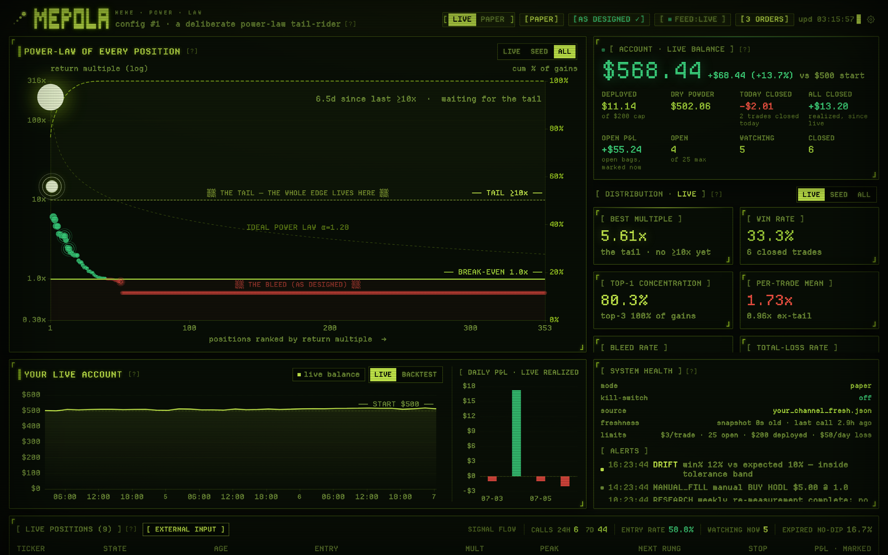
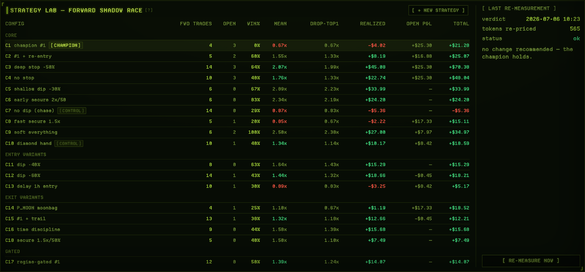
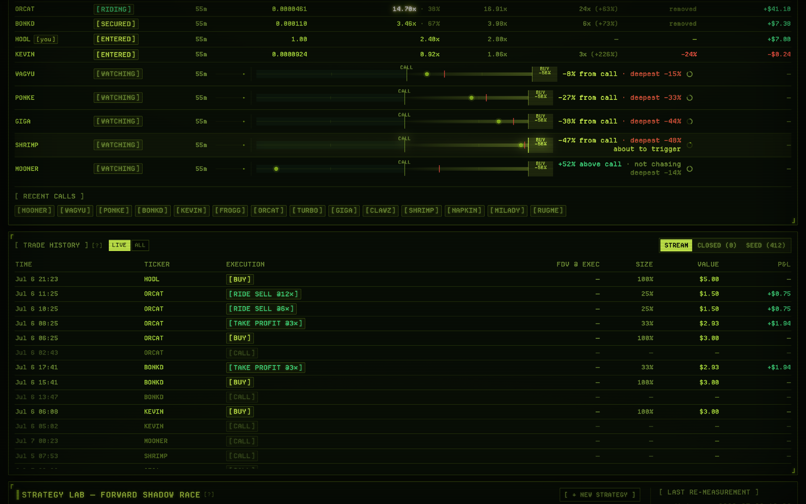
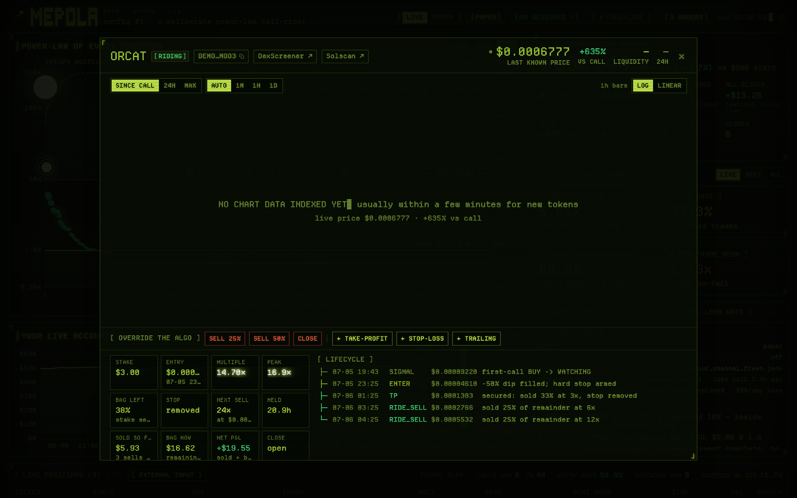
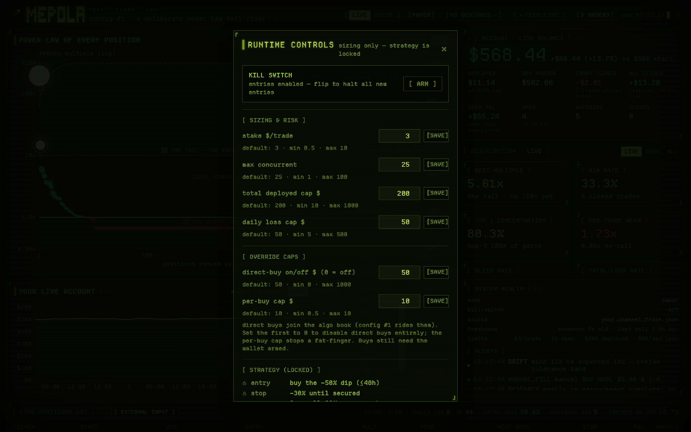

<p align="center">
  
</p>

**MEPOLA** (*MEme POwer LAw*) is an autonomous Solana trading machine built on one idea:
memecoin returns follow a power law, and every part of this machine (entries, exits,
sizing, expectations, the dashboard you watch) is designed for that distribution. Averages
lie in this domain, so nothing here leans on one.

It reads calls from your Telegram group or channel, waits for its price, runs a measured
dip-entry tail-riding strategy 24/7, races 18 challenger strategies against it on the same
live ticks, and puts you in the loop with manual orders, per-token overrides, your own
token injections and your own strategy variants. All of it renders on a phosphor-CRT
terminal dashboard.



## The two facts underneath everything

We measured a corpus of 1,263 first-calls from a real channel before writing a line of
engine code. Two results survived every re-test, and they pull in opposite directions.

The tail is real. The corpus contains a verified ~700x runner, and the top ~1% of tokens
carries most of the aggregate gain. A distribution like this breaks means and win rates as
tools. One token can be the P&L of a quarter.

Your seat is late. By the time a call reaches you, price sits (median) 2.65x above the
callers' own entry. Measured with a full dead-token denominator, latency-real fills and
bootstrap confidence intervals, a follower's per-trade EV lands below 1 under every exit
policy we tried, and no field observable at entry separates the future tail from the
graveyard (every feature we tested scored ~0.50 rank-AUC).

So the design question became: if the edge isn't buyable, what is the best-shaped vehicle
for holding tail exposure while surviving the bleed? A 144-configuration grid search
answered that, out-of-sample. The full record (11 tested angles, every number, and the six
false positives we caught on the way) is in **[RESEARCH.md](RESEARCH.md)**.

## The strategy

Config #1, the dip-entry tail-rider:

1. On a call, wait. Watch up to 48h for a 50% dip from the signal price. No dip, no trade.
2. Buy the dip. Hold a hard stop 30% below entry. The entry already sits at half the call
   price, so the rare tail token has usually bottomed and lives through the stop.
3. At 3x, sell 33%. The stake is back in your pocket and the stop comes off.
4. Sell 25% of the remainder at 6x, 12x, 24x and 48x, then continue in 3x steps (144x,
   432x, ...). The final moonbag never fully exits.
5. No re-entry.

```
WATCHING -- price <= 0.5x signal within 48h --> ENTERED -- 3x hit --> SECURED --> RIDING --> EXITED
   |                                              |  (sold 33%, stop off)  (25% of rem at
   +-- 48h passes, no dip --> EXPIRED (skip)      |                        6/12/24/48x, x3...)
                                                  +-- price <= 0.7x entry (pre-secure) --> STOPPED
```

Traded straight through the out-of-sample window with no foresight, this shape ends +43%
to +55% while the naive follow-the-post seat loses ~20% per trade. The gain concentrates
in the tail and the strategy dies above roughly $10-25 per trade on a $500-class bankroll
(see [Sizing](#sizing)). `tests/test_strategy_equivalence.py` pins the live engine
floating-point-exact to the research simulation, so the thing that trades is the thing we
measured.

## What the machine does

### The autonomous engine

A Telethon listener feeds a signal parser, which feeds the TailRider state machine, which
feeds a multi-source price feed and an executor. Everything runs async on SQLite with a
single writer, idempotent order keys and crash-safe restarts. A monitor process watches
feed liveness, listener health, fill-vs-model drift and paper/backtest equivalence, and
pushes alerts to the dashboard. Paper mode is the default. Live execution (Jupiter swaps)
books a fill only after the transaction confirms on-chain, and ships inert behind five
gates: config mode, two env arms, a burner-wallet allowlist and a kill switch.

### Manual trading and overrides

The algo is the default, and you can step in at any level:

- Place manual orders on any token: buy or sell, market or trigger, with triggers by
  price, multiple or P&L, optional expiry, and stake or percent sizing. Resting orders
  show in the header; cancel or modify them any time.
- Take over any algo position. The engine stops managing it, you trade it from the token
  terminal (take-profit, stop-loss, trailing stop, partial sells, close), and you can
  release it back to the algo when done.
- Sell into a pre-secure position and the engine re-arms the hard stop on what remains.
  A manual partial exit keeps your downside protection.
- Direct buys join the algo book, so a token you bought by hand still gets the config #1
  ladder unless you take it over. A per-buy cap and a direct-buy switch in runtime
  controls keep fat fingers bounded.

### Bring your own signals

`[EXTERNAL INPUT]` accepts any contract address. It fetches ticker, FDV and liquidity,
then you choose: inject it as a signal (the engine treats it like a channel call and
watches for the dip), add it to the watchlist to track without trading, or buy it now.
Your alpha doesn't have to come from one channel.

### Build your own strategy

The strategy lab races 18 built-in challengers (deeper stops, no stop, chase entries,
trails, moonbags, regime gates and more) against the champion on the same live ticks, so
every week of deployment produces fresh out-of-sample evidence. Add your own variants: the
builder takes an entry mode (dip %, chase, or 1h delay), a stop, a secure multiple and
sell fraction, and a re-entry rule, then your config joins the race under an X* id. You
can prefill it from any existing challenger. A re-measure runs the whole grid on demand
and prints a verdict. Promotion stays human-only; the machine measures and reports, and a
person decides.



### A paper twin with full functionality

A practice book runs beside the live book: same engine, same UI, simulated money. The
LIVE/PAPER toggle is per-tab, so a practice click can never route to the live book.
Everything works there, including external input, manual orders and overrides. Learn the
machine before you arm it.

### The dashboard

FastAPI plus React/ECharts behind basic auth, styled as a phosphor CRT instrument
(`DESIGN.md` is the design law). The hero chart is the power law itself: every position
ranked by return multiple on a log scale, with break-even, bleed and tail reference lines,
plus a Pareto curve showing how much of the P&L is one token. A status banner answers a
sharper question than "is it up": is the machine behaving as the research said it would,
bleed included?

The positions table shows every WATCHING token with a dip-progress bar, distance to
trigger and expiry clock, plus every open position with its lifecycle state. The stream
logs every order and event, FDV-tagged at the executed price. Updates arrive over a
WebSocket.



Click any token and you get a terminal for it: candles since the call with entry, stop and
rung overlays, log or linear scale, the full lifecycle event log, links out to DexScreener
and Solscan, and the override controls when you've taken it over. The screenshot below is
the seeded replay of the corpus tail event, a 197.61x ride from a $3 stake.



Runtime controls expose the sizing and risk knobs (stake per trade, max concurrent, total
deployed cap, daily loss cap, per-buy cap) inside research-measured hard bounds, plus the
kill switch. The strategy itself stays locked. Knobs change how much you risk; the
strategy definition lives in config and code.



### The research harness

Every number in [RESEARCH.md](RESEARCH.md) is reproducible from this repo: corpus
ingestion from your channel's history, disk-cached OHLCV, a pessimistic fill simulator
(latency window, slippage, gas, dead tokens scored as total losses), exit-policy
simulation, excursion analysis, and 60+ stage, attack and refute scripts. Point them at
your own channel's corpus and measure it before you trust it.

## Sizing

Stake sizing is yours to set. `config.toml` takes a fixed-dollar or fraction-of-equity
mode, and the dashboard adjusts stake, concurrency, deployed-capital and daily-loss caps
at runtime. Bankrolls and risk tolerance differ per person; the machine doesn't assume
yours.

The envelope, though, was measured. On a $500-class backtest bankroll the strategy
survives small stakes and busts above roughly $10-25 per trade, because sizing up
amplifies the bleed faster than the tail repays it. The risk governor enforces a hard
per-trade cap and there is no code path that scales stake with equity. Scale the numbers
to your bankroll and keep the proportions.

## Audits

The codebase went through several independent review passes before the live path was ever
armed: multi-agent adversarial audits (100+ agents sweeping for correctness, money-path
safety, idempotency and honesty of displayed numbers), automated code review, an
independent review by a different model family (OpenAI Codex), and a focused delta audit
after each feature. Together they produced 50+ confirmed findings, 19 of them real-money
blockers, all fixed and regression-tested. The reports are published as-is:

| report | scope |
| --- | --- |
| [audit-2026-07-04-live-path](docs/audits/audit-2026-07-04-live-path.md) | first exhaustive engine + dashboard audit (56 findings, 19 real-money blockers) |
| [audit-2026-07-05-remediation](docs/audits/audit-2026-07-05-remediation.md) | remediation tracker, every blocker closed with its fix |
| [audit-2026-07-06-final-findings](docs/audits/audit-2026-07-06-final-findings.md) | final pre-arming audit, full codebase, multiple workflows |
| [audit-2026-07-06-final-tracker](docs/audits/audit-2026-07-06-final-tracker.md) | final verification passes and the arming decision trail |

The 330-test suite pins the engine to the research sims, exercises the fail-closed gates
and regression-tests every audit finding.

## Quick start (demo, no Telegram needed)

```bash
uv sync --extra dev --extra dashboard
uv run pytest                                  # full test suite

# build the frontend once:
npm --prefix dashboard/frontend install
npm --prefix dashboard/frontend run build

# realistic demo DB + dashboard:
PYTHONPATH=src python3 scripts/make_demo_db.py --out /tmp/demo_state.db
MEMEBOT_DB=/tmp/demo_state.db uv run --extra dashboard \
    uvicorn dashboard.server.app:app --host 127.0.0.1 --port 8000
# open http://127.0.0.1:8000
```

## Run it on your channel

1. Copy `.env.example` to `.env` and fill in your Telegram API credentials (the comments
   walk you through it). The account must have joined the channel you want to follow.
2. Set `MEMEBOT_CHANNEL=@your_channel`.
3. Start the paper loop: `PYTHONPATH=src python -m memebot.live.run`
4. Pull the channel's history and run the research harness on it. Measure your channel
   before you trust it: [RESEARCH.md](RESEARCH.md) and [`docs/RUNNING.md`](docs/RUNNING.md).

Deployment on Railway or a VPS: [`docs/DEPLOY_RAILWAY.md`](docs/DEPLOY_RAILWAY.md),
[`docs/DEPLOY.md`](docs/DEPLOY.md).

Going live with real money requires five gates to align (config mode, two env arms, the
`MEMEBOT_BURNER_PUBKEY` allowlist and the kill switch) plus a first dust trade reconciled
on-chain. Read [`docs/GO_LIVE.md`](docs/GO_LIVE.md) first. Use a burner wallet, always.

## Repo map

```
src/memebot/          research library: models, parser, ingest, data clients, exit sims,
                      fill simulator, backtest harness, safety checks
src/memebot/live/     the 24/7 machine: strategy, engine, executor, risk governor, state,
                      price feed, listener, monitor, shadow lab, jupiter swaps
dashboard/            FastAPI server + React/ECharts frontend (the MEPOLA CRT terminal)
scripts/              60+ research CLIs (stage0..stage39, attack_*, refute_*) + utilities
docs/                 system design, running, deploy, go-live, audits/
RESEARCH.md           the full research story. Start here.
DESIGN.md             the dashboard's design law
```

## License

MIT. See [LICENSE](LICENSE).

## Disclaimer

This is not financial advice and this software does not produce reliable income. The
research in this repo exists to show what following call channels is and isn't worth.
Memecoin trading carries extreme risk: expect long stretches of small losses, most tokens
go to zero, and profitable periods tend to hang on a single tail event. If you run this
with real money, use a burner wallet, keep stakes inside the measured envelope, and treat
the capital as money you can lose in full.
